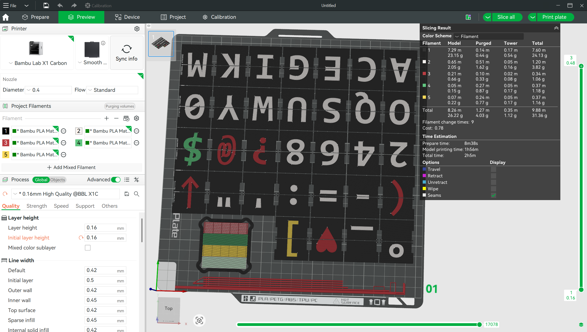

# Flaps generator (`flaps.scad`)

## OpenSCAD (brief)

[OpenSCAD](https://openscad.org/) is a script-based 3D CAD tool: you describe models as code (extrusions, booleans, imports), adjust parameters, then preview or fully render solid geometry and export meshes (e.g. STL). There is no interactive mesh sculpting—changes are edits to the `.scad` file.

## What `flaps.scad` does

The script builds a grid of split-flap blanks matching the outline in `flap.dxf`. For each flap it uses **three adjacent characters** from your sequence (previous / visible / next) so the physical flap matches how letters wrap on a drum.

You control:

- **`fonts`** — list of OpenSCAD font strings (e.g. `Consolas:style=Bold`). Any style your system has installed works the same way as a single `text()` `font=` argument.
- **`charFont`** — **64 integers**, one per character index in **`chars`**. Each value picks which entry in **`fonts`** to use for that glyph (e.g. `0` → first font, `1` → second).
- **`fontsize`** — base letter height passed to OpenSCAD `text()` on each flap face
- **`chars`** — exactly **64 characters** in order; index `0…63` maps to the printed sheet (the loops stop before character index 64)
- **`colorLayer`** — **64 integers**, one per character. Each value is an index into **`colors`**. It selects the **filament / inlay export pass** for that character: letter geometry for a given layer is emitted only when you call `MakeFlaps(<that index>)`.
- **`colors`** — names (or `#hex` strings) used for **preview** coloring in OpenSCAD. Every **`colorLayer`** value must be a valid index into this list (`0` for the first color, through the last entry).
- **`charSizeOffset`** — per-character adjustment added to **`fontsize`** (e.g. make `@` slightly smaller).
- **`charYposOffset`** — per-character **vertical** placement on the visible face (`text()` default is centered; marks like `'` may need nudging).
- **`layers`** / **`layerheight`** — thickness of the flap stack and each letter slice (matches the extrusion height used for the outline and glyphs).

At the top of `flaps.scad`, **`MakeFlaps(99)`** produces the flap bodies with letter cutouts. For multi-color inlays, call **`MakeFlaps(0)`**, **`MakeFlaps(1)`**, … once per distinct **value** you use in **`colorLayer`** (each call exports only glyphs assigned to that layer). **`PreviewFlaps()`** draws the full grid for on-screen preview and is not meant for STL export.

## How to use

1. Set **`fonts`**, **`charFont`**, **`fontsize`**, **`chars`**, **`colors`**, **`colorLayer`**, and optionally **`charSizeOffset`** / **`charYposOffset`** / **`layers`** / **`layerheight`**. Arrays with one entry per character (**`charFont`**, **`colorLayer`**, **`charSizeOffset`**, **`charYposOffset`**) must stay index-aligned with **`chars`**.
2. **Flap bodies:** Activate **`MakeFlaps(99);`** and comment out any **`MakeFlaps(<layer>)`** inlay calls (and **`PreviewFlaps()`** if you want a clean export). Run a **full render** (OpenSCAD: **F6**), then **Export → Export as STL**.
3. **Letter inlays (one STL per color layer):** For each layer index `L` that appears in **`colorLayer`**, set **`MakeFlaps(L);`** (and comment out the other passes). Full render (**F6**), export STL. Repeat for every `L` you use (e.g. `0…3` if you use four **`colors`** slots).

   *(Preview-only **F5** is not enough for a clean STL export; always use full render for exports.)*

4. **Bambu Studio (or any multi-material slicer):** Import the body STL plus **each** inlay STL. When prompted, choose **import as a single object** so all parts stay aligned.
5. Assign **Filament 1**, **Filament 2**, … so each imported inlay mesh maps to the filament that matches **`colors`** / your **`colorLayer`** plan (same count as the distinct layer indices you exported).

Example in Bambu Studio (Preview): one grouped object with body + inlay STLs, each mapped to a filament slot.

License for this generator: see comments in `flaps.scad` (Creative Commons BY-NC-SA 4.0).
